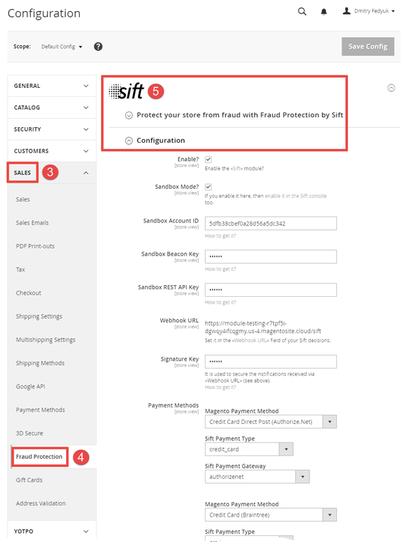
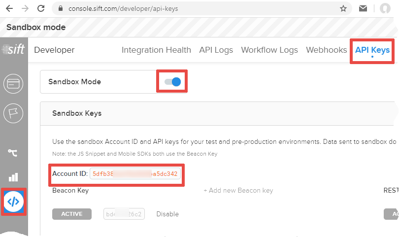
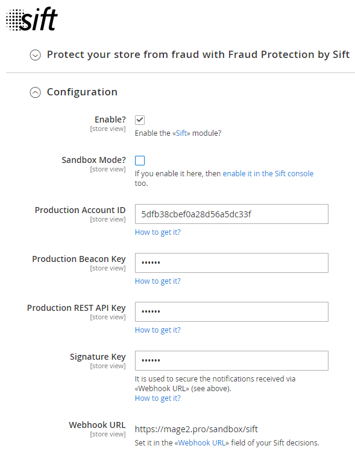
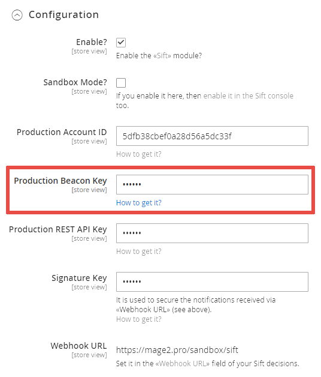
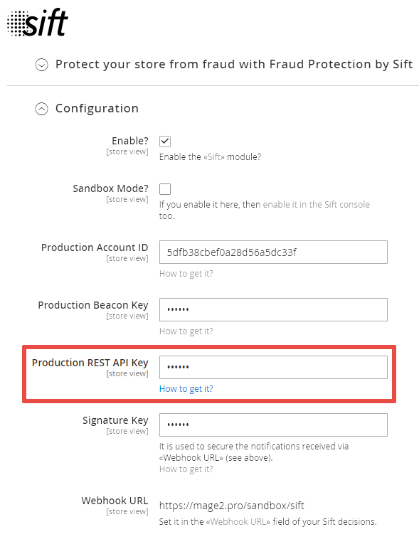
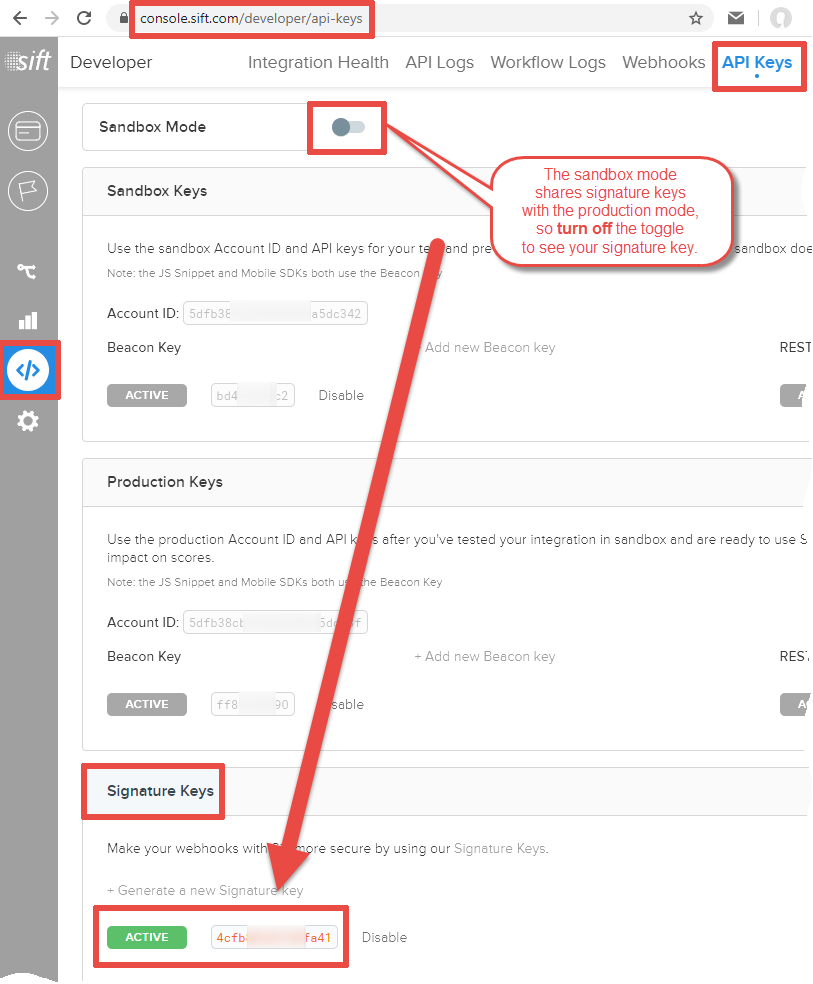
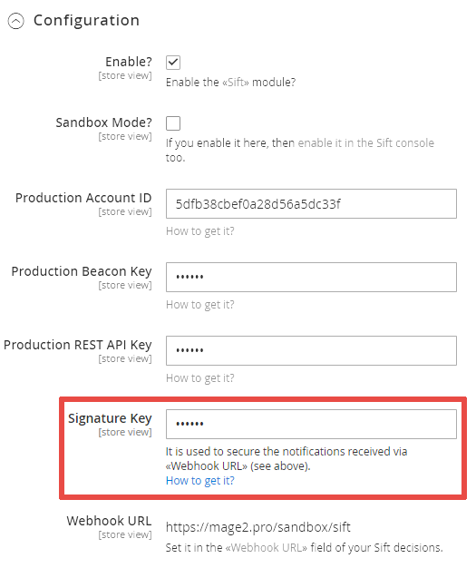
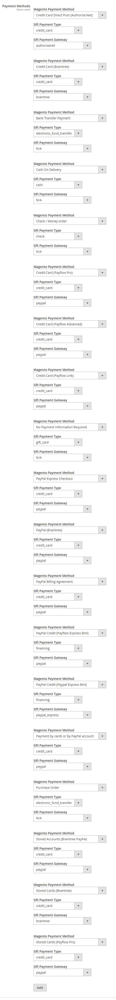

# How to setup the module
## 1. Locate the module settings inside the Magento backend 
«**STORES**» → «**Configuration**» → «**SALES**» → «**Fraud Protection**» → «**Sift**»: 
<table><tr>
	<td></td>
	<td></td>
</tr></table>

## 2. Place your Sift credentials to the Magento backend
You need **4** Sift credentials to setup the module:
### 2.1. Account ID
#### 2.1.1. «Account ID» in Sift
<table>
	<thead><tr><th>Sandbox Mode</th><th>Production Mode</th></tr></thead>
	<tbody><tr>
		<td></td>
		<td></td>
	</tr></tbody>
</table>

#### 2.1.2. «Account ID» in Magento

### 2.2. Beacon Key
#### 2.2.1. «Beacon Key» in Sift
<table>
	<thead><tr><th>Sandbox Mode</th><th>Production Mode</th></tr></thead>
	<tbody><tr>
		<td></td>
		<td></td>
	</tr></tbody>
</table>

#### 2.2.2. «Beacon Key» in Magento

### 2.3. REST API Key
#### 2.3.1. «REST API Key» in Sift
<table>
	<thead><tr><th>Sandbox Mode</th><th>Production Mode</th></tr></thead>
	<tbody><tr>
		<td></td>
		<td></td>
	</tr></tbody>
</table>

#### 2.3.2. «REST API Key» in Magento

### 2.4. Signature Key
#### 2.4.1. «Signature Key» in Sift
A signature key is used to [authenticate](https://sift.com/developers/docs/php/decisions-api/decision-webhooks/authentication) the [decision notifications](https://sift.com/developers/docs/php/decisions-api/decision-webhooks) received by Magento from Sift.  
The sandbox mode shares signature keys with the production mode, so turn off the «Sandbox Mode» toggle to see your signature key.

#### 2.4.2. «Signature Key» in Magento

## 3. Set the module's webhook URL to every Sift decision in the Sift console
...

## 4. Map the used Magento payment options to Sift constants
The module passes the chosen payment method to Sift within the [`$create_order`](https://sift.com/developers/docs/curl/events-api/reserved-events/create-order) event's payload.  
Sift requires that [`$payment_type` and `$payment_gateway`](https://sift.com/developers/docs/curl/events-api/complex-field-types/payment-method) field values should belong to fixed sets, so you need to setup a mapping between Magento payment methods used in your store and the allowed `$payment_type` and `$payment_gateway` values.  
The module already maps built-in Magento payment methods to reasonable `$payment_type` and `$payment_gateway` values, so you need to setup such mapping only for third-party payment modules.  
  