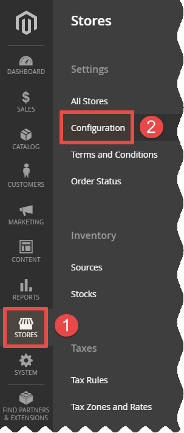
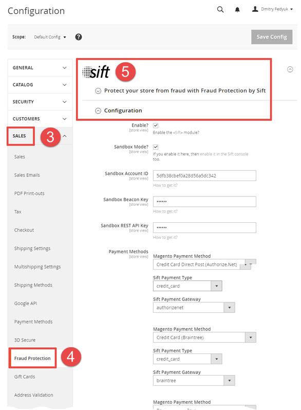

## How to setup the module
The module's settings are located in the «**STORES**» → «**Configuration**» → «**SALES**» → «**Fraud Protection**» → «**Sift**» section: 
<table><tr>
	<td></td>
	<td></td>
</tr></table>

You need 3 Sift credentials to setup the module:
### Account ID
<table>
	<thead>
		<tr>
			<th>Sandbox Mode</th><th>Production Mode</th>
		</tr>
	</thead>
	<tbody>
		<tr>
			<td></td>
			<td></td>
		</tr>	
	</tbody>
</table>

### Beacon Key

### REST API Key
