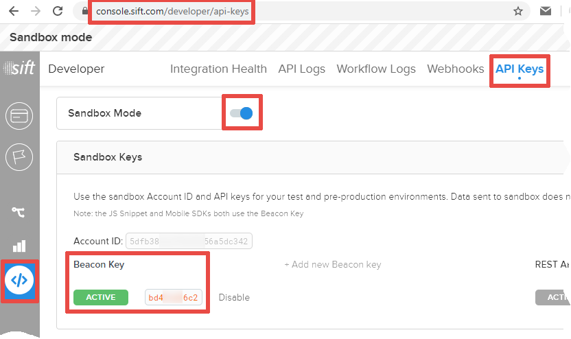

# How to setup the module
The module's settings are located in the «**STORES**» → «**Configuration**» → «**SALES**» → «**Fraud Protection**» → «**Sift**» section: 
<table><tr>
	<td></td>
	<td></td>
</tr></table>

## Credentials
You need 3 Sift credentials to setup the module:
### 1. Account ID
<table>
	<thead><tr><th>Sandbox Mode</th><th>Production Mode</th></tr></thead>
	<tbody><tr>
		<td></td>
		<td></td>
	</tr></tbody>
</table>

### 2. Beacon Key
<table>
	<thead><tr><th>Sandbox Mode</th><th>Production Mode</th></tr></thead>
	<tbody><tr>
		<td></td>
		<td></td>
	</tr></tbody>
</table>

### 3. REST API Key
<table>
	<thead><tr><th>Sandbox Mode</th><th>Production Mode</th></tr></thead>
	<tbody><tr>
		<td></td>
		<td></td>
	</tr></tbody>
</table>

## Payment Methods
The module passes the chosen payment method to Sift within the [`$create_order`](https://sift.com/developers/docs/curl/events-api/reserved-events/create-order) event's payload.  
Sift requires that [`$payment_type` and `$payment_gateway`](https://sift.com/developers/docs/curl/events-api/complex-field-types/payment-method) field values should belong to fixed sets, so you need to setup a mapping between Magento payment methods used in your store and the allowed `$payment_type` and `$payment_gateway` values.  
The module already maps built-in Magento payment methods to reasonable `$payment_type` and `$payment_gateway` values, so you need to setup such mapping only for third-party payment modules.  